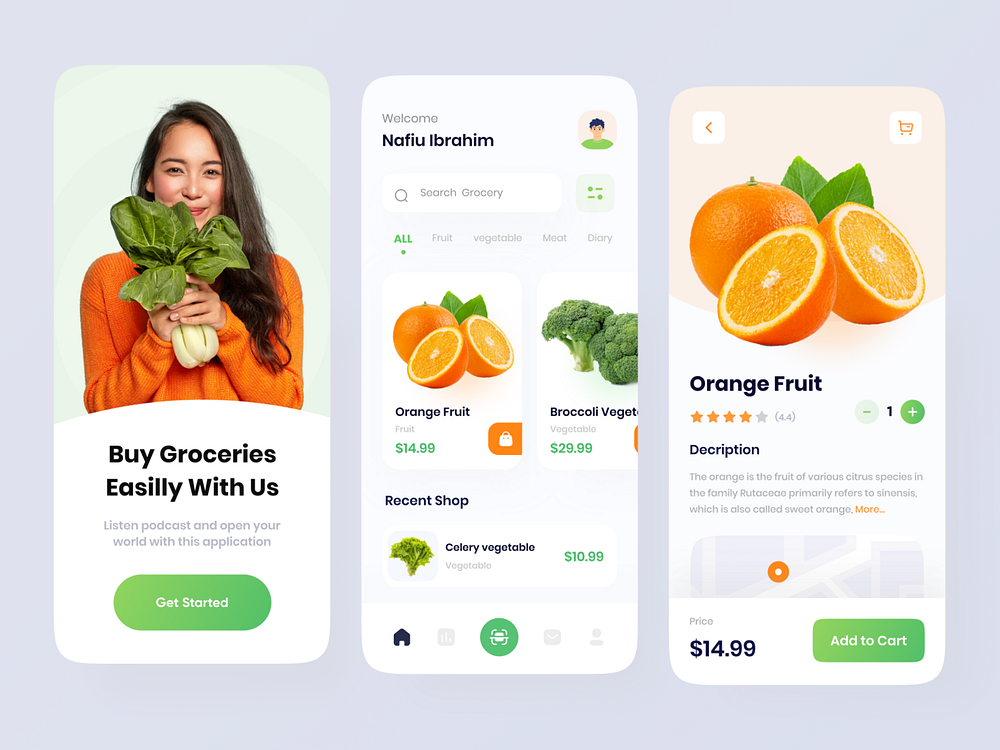

# vendor app
it is a web app that offers online market for fruits, veges and cereals
# Link
Visit: [Vendor App](https://vendor-web-app.onrender.com/)
# UI

# key  concepts
1.state management of nav links using hash function 
2.listing of products using v-for directive 
3.components(registration,props,events,v-modeling) 
  a.home component 
  b.products component 
  c.contact component 
  d.cart component 
4.methods and computed propert for calculating 
     *total cost for each item 
     *total cost for all items 
     *total number of all items in cart 
 5.passing data between sibling components using emits and props   
 6.fetching products from json file using **FETCH API** 
 7.storing products in local storage

# Goals
1.nav links management using vue routing 
2.API intergration for check out functionality 
3.mobile App() 
4.state management using Pinia
